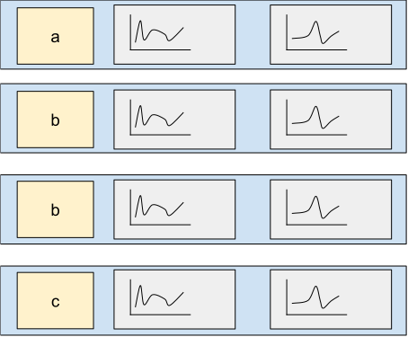

<!-- README.md is generated from README.Rmd. Please edit that file -->

# tsrecipes

<!-- badges: start -->

<!-- badges: end -->

The goal of tsrecipes is to provide steps for the
[recipes](https://github.com/tidymodels/recipes/) package and
[tidymodels](https://www.tidymodels.org/) framework for preprocessing
time series into features for machine learning.

This package is modeled after the
[textrecipes](https://github.com/tidymodels/textrecipes): both packages
transform a sequence of data (words vs. time series).

In addition to the unique addition of the discrete cosine transform,
tsrecipes also provides recipe steps for transformations found in the
[feasts](https://feasts.tidyverts.org/) R package.

And features from the Python package
[tsfresh](https://github.com/blue-yonder/tsfresh), although at the
moment it contains many more transformations.

tsrecipes supports three categories of time series feature engineering:

  - time series transformations
  - time series clustering
  - time series feature extraction

The goal of time series preprocessing is to support unsuperived and
supervised machine learning. Either time series classification, where
you want to predict the label associated with a time series (or set of
time series).

This also supports generalized feature enigneering for machine learning
models. Features into machine learning are often implicitly aggregated
over a period of time. For example, maybe a feature is the number of
hours watched in a month, or total time spent visiting a website. But
you can lose a lot of information by only considering the aggregate
total. Treating features as a time series may increase the predictive
power of the model.

## Installation

You can install tsrecipes with:

``` r
# install.packages("devtools")
devtools::install_github("tmastny/tsrecipes")
```

## Time series preprocessing

You want to apply time series preprocessing when you have a set of
related time series:



Each entry of the set may belong to a class or label. The entries may
also be multivariate time series.

In general, it’s not feasible or recommended to use the raw time series
values as classification or clustering features.


Why do we need time series preprocessing in the first place? You could
each entry of the time series a feature:

    #> # A tibble: 965 x 6
    #>    class           `1`     `2`    `3`    `4`    `5`
    #>    <fct>         <dbl>   <dbl>  <dbl>  <dbl>  <dbl>
    #>  1 no_increase -4.15   -0.770   2.01  -2.69   2.04 
    #>  2 no_increase -0.749   0.943  -0.187  0.375 -0.933
    #>  3 no_increase  4.93    1.06    0.774 -0.264  0.301
    #>  4 no_increase  1.15   -0.0380  0.975 -0.615 -0.189
    #>  5 no_increase  3.08   -0.660   0.166  1.69  -2.19 
    #>  6 no_increase  1.59   -0.419  -0.511  1.29  -0.247
    #>  7 no_increase -0.824   2.84   -1.03  -0.683  0.209
    #>  8 no_increase  0.0330  0.0659 -1.12   1.97  -0.588
    #>  9 no_increase -1.24   -1.30    3.84   1.01   0.363
    #> 10 no_increase  0.252   3.30   -8.63  -1.53   1.71 
    #> # … with 955 more rows

Raw time series make poor features, since they are typically high
dimensional. And even if you have a model that handles high dimensional
data, the important information of the time series might be the overall
trend or seasonality: not the raw value of any particular day (see
[autocorrelation](https://otexts.com/fpp3/acf.html)).

Then the goal of preprocessing is to find qualities of the time series
that are actually important, and to reduce the dimension of the
features.

## Transformations

Transformations are all about changing the time series to an alternative
representative. Think of it like the binary representation of a number:

> 29 \<-\> 11101

The number is the same either way and the process is entirely
reversible. But yet each representation has it’s own unique properties.

For time series, the fast Fourier transform and the discrete cosine
transform are the most important. They provide

  - uncorrelated features
  - unsupervised dimensionality reduction


## Feature Selection

todo: probably want to never remove the ts column and have the user
`step_rm` it at the end.

textrecipes always overwrites columns, but that has the problem of
comparing original to reconstruction.

## References

Sayood, K. (2006). *Introduction to data compression*.

Primer on DCT: <https://squidarth.com/rc/math/2018/06/24/fourier.html>
